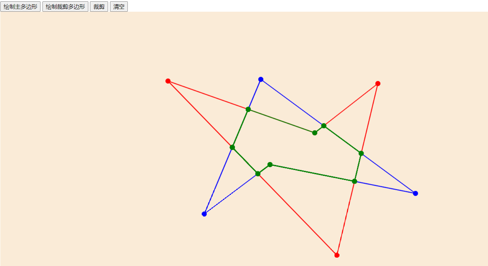
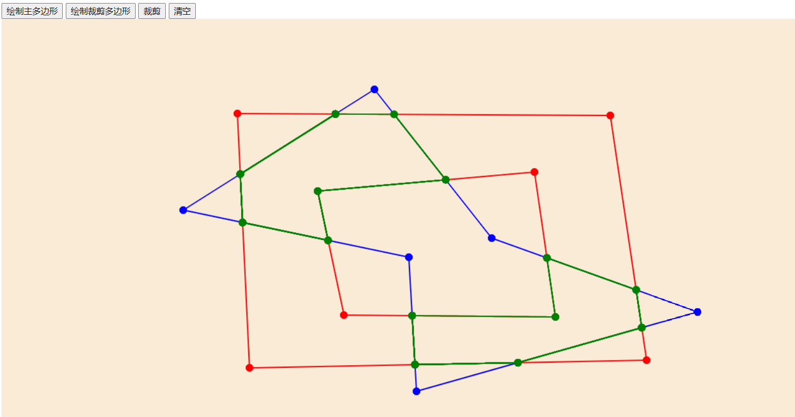
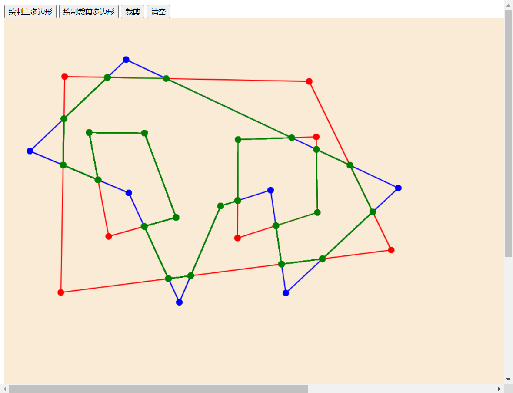

# Weiler-Atherton 多边形裁剪算法

## 运行方法

直接打开`src/index.html`即可使用实验的GUI界面。其中绘制主多边形按钮点击后可以左键点击绘制多边形的点，右键形成闭合多边形；绘制裁剪多边形按钮类似；点击裁剪按钮即可查看裁剪的结果；点击清空按钮可以清空画布。

需要注意的是，**画外环必须逆时针，画内环必须顺时针**！

## 效果展示

1. 凹多边形裁剪

   

2. 课件上的例子

   

3. 两个内环的裁剪

   
   
4. 裁剪多边形和主多边形都含内环

	

5. 两个外环的裁剪多边形

   